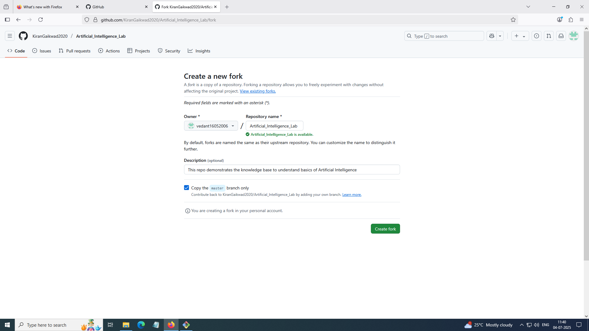
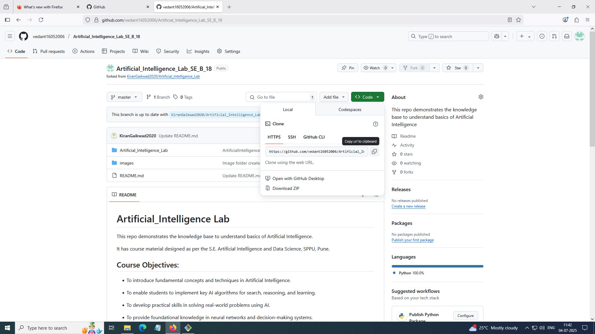
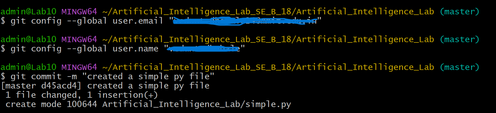
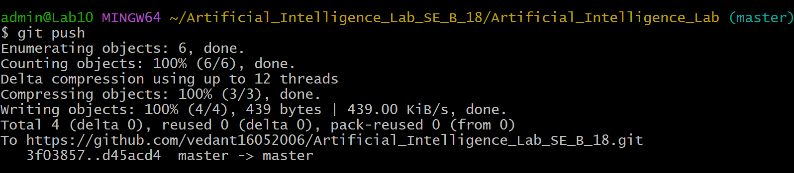
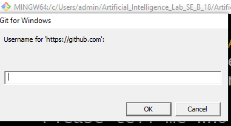
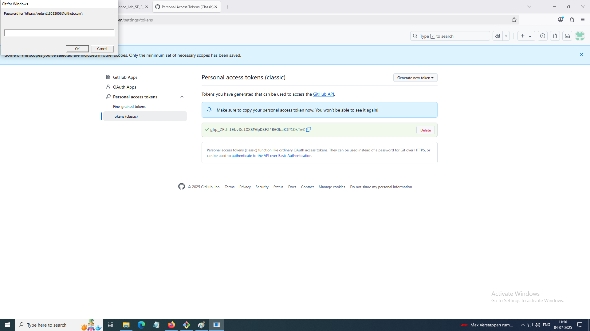

# Github Profile Creation, Fork, Clone, Update Repository

## 1. Create a github profile

   a. Visit the https://wwww.github.com
   
   b. Click on SignUp tab present in the upper right corner
   
   c. You will be directed to Account Creation Page as follows.
   
   
   
   d. Fill all the required fields and Click on continue button which will create your Github Account.
   

## 2. Fork the existing repository

   a. Use the existing Github repository URL (example- https://www.github.com/KiranGaikwad2020/Artificial_Intelligence_Lab)
   
   b. You will be landing to the existing Github repository, Click on Fork tab present on upper right side.

   
   
   c. Update the repository name as per your requirement.
   
   
      
   d. And click on **Create Fork** button
   
   

## 3. Clone the forked remote repository to the local system

   a.  Copy the https repo URL 
   
   
   b. Use the command on Local Machine Terminal ---> **$git clone https URL**

   c. Verify the cloned repository on local machine using command **ls** in present working directory.

## 4. Update the changes in cloned local repository

   a. Create sample file in your local github repository.

   b. Use the command **$git status** to verify the status of local github repository.

   c. Use the command **$git add filename** to add the created file in local git environment.
   

   d. Use the command **$git commit -m "message string"** to commit the changes.

   e. Use the command **$git config --global user.email "email-id" and $git config --global user.name "name"** to configure the local git environment for authenticity

   

## 5. Push the updated cloned local repository to remote github repository

   a. Use the command **$git push** to push the local updates to the remote github repository.

   

   b. Enter the user credneitals of github account.
   
   
   
   
   
   

   c. Verify the updated remote github repository.
